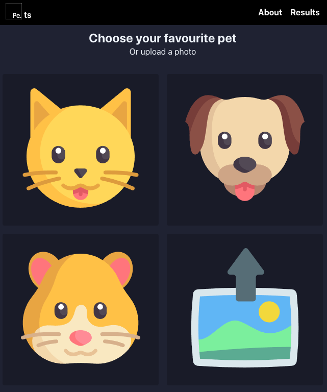

Pe.ts
===

 

A simple web app, using React and AWS services. It is used to demonstrate some basics of Platform Engineering.

See [docs](docs) for documentation and tutorials.

Contributions welcome. Please [raise issues](https://github.com/sohrab-/pets/issues) if something is not working or [submit pull requests](https://github.com/sohrab-/pets/pulls) if you want to fix something.