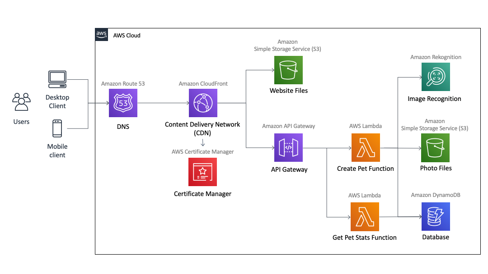

Design
===

This page documents the design of this application, used by developers, to implement the features.

Overview
---

An interactive application, backed by a REST API, deployed to AWS, to demonstrate what being a developer in Platform Engineering is like.

Let's make this a pet selection app. User pick their favourite pet or one that they own. The selection is sent to a REST API, implemented in AWS Lambda. The API stores the results and there will a results page to see some stats about the overall selections.

To make things a bit more interesting, instead of selecting a pet, the user can submit a photo and we perform some image recognition and derive the pet type for the selection.

Architecture
---

This is to a native AWS application so a few different AWS services are used.



| Component | AWS Implementation | Description
|-----------|--------------------|------------
| DNS | Route53 Record | Resolves pets.soe.dpe-au.io to the IP for CloudFront
| CDN | CloudFront Distribution | Serves and caches the web UI. Also forwards requests to the API Gateway.
| Certificate Manager | ACM Certificate | Issues the certificate that secures pets.soe.dpe-au.io
| Static website files | S3 Bucket | Stores the static website files, served by CloudFront
| API Gateway | API Gateway | Routes incoming REST API requests to corresponding Lambda functions
| Create Pet Function | Lambda Function | Handles incoming pet selections
| Image Recognition | Rekognition | Labels objects in a given image
| Database | DynamoDB Table | Stores the pet selections
| Photo files | S3 Bucket | Stores the submitted images
| Get Pet Stats | Lambda Function | Handles calculating stats for display on web UI

Wireframes
---

### Home Page

```
+----------------------------------------------+
| LOGO                  RESULTS   API   ABOUT  |
+----------------------------------------------+
|                                              |
|      +-------------+     +-------------+     |
|      |             |     |             |     |
|      |             |     |             |     |
|      |    PET 1    |     |    PET 2    |     |
|      |             |     |             |     |
|      |             |     |             |     |
|      |             |     |             |     |
|      +-------------+     +-------------+     |
|                                              |
|                                              |
|      +-------------+     +-------------+     |
|      |             |     |             |     |
|      |             |     |             |     |
|      |    PET 3    |     |    UPLOAD   |     |
|      |             |     |    PHOTO    |     |
|      |             |     |             |     |
|      |             |     |             |     |
|      +-------------+     +-------------+     |
|                                              |
+----------------------------------------------+
```

* Icon buttons for 3 common pets: cat, dog, hamster (?)
* 4th button to upload a photo of a pet
* Navbar to navigate to other pages - should be visible on all pages

### Results Page

```
+----------------------------------------------+
|LOGO                   RESULTS   API   ABOUT  |
+----------------------------------------------+
|                                              |
|  +------------------+  +------------------+  |
|  |                  |  |                  |  |
|  |                  |  |                  |  |
|  |     PIE CHART    |  |     PIE CHART    |  |
|  |   COUNT BY TYPE  |  |  COUNT BY CLIENT |  |
|  |                  |  |                  |  |
|  |                  |  |                  |  |
|  |                  |  |                  |  |
|  +------------------+  +------------------+  |
|                                              |
|  +----------------------------------------+  |
|  |                                        |  |
|  |                                        |  |
|  |             BAR/LINE CHART             |  |
|  |         COUNT BY CREATION TIME         |  |
|  |                                        |  |
|  |                                        |  |
|  +----------------------------------------+  |
|                                              |
|----------------------------------------------|
```


REST API
---

| Operation | Request | Response
|-----------|---------|---------
| `POST /pets` | `{ "type": "cat" }` | `{ "id": "<UUID>", "type": "cat" }`
| `POST /pets` | `{ "image": "<encoded image>" }` | `{ "id": "<UUID>", "type": "cat" }`
| `GET /petStats` | `?groupBy=type` | `{ "cat": 12, "dog": 10 }`
| `GET /petStats` | `?groupBy=client` | `{ "desktop": 5, "mobile": 23 }`

> TODO: Replace this with an OpenAPI specification

Interactions
---

### Create Pet


### Get Stats

_Coming Soon_

Technology Stack
===

* [JavaScript](javascript.com): Programming language for both the UI and serverless
* [AWS SAM](aws.amazon.com/serverless/sam): AWS Lambda development framework
* [React](reactjs.org): JavaScript library to build the user interface
* [Theme-UI](theme-ui.com): Theme-able React components
* [Chart.js](chartjs.org): Charts in JavaScript
* [Prettier](prettier.io): Opinionated code formatter

